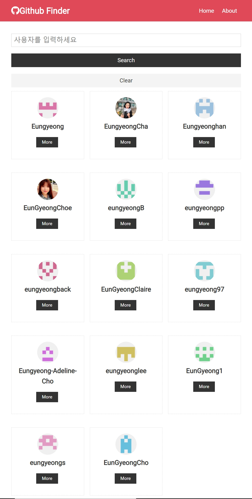
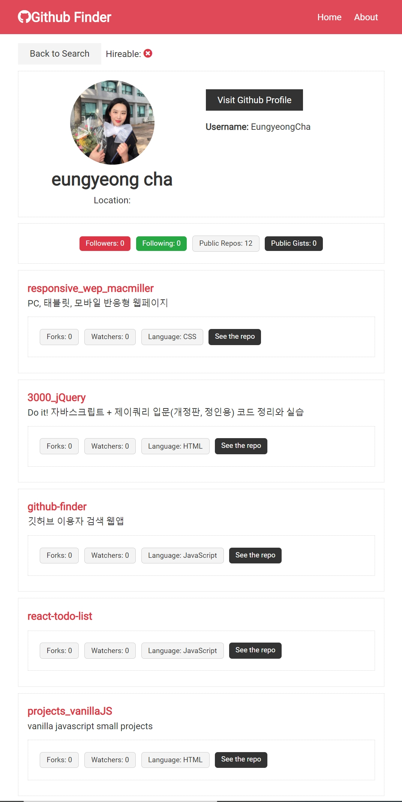

## Github Finder

#### Description:
깃허브 API를 이용하여 사용자 이름 검색시 해당 사용자 목록과 정보를 불러오는 앱입니다.
- React(Hooks: useState useEffect useContext useReducer), CSS

## APP
[앱 보기](https://githubfinder92578392.netlify.app)

## Project Screen Shot
  

## Installation and Setup Instructions

Clone down this repository. You will need `node` and `npm` installed globally on your machine.  

Installation:

`npm install`  

To Run Test Suite:  

`npm test`  

To Start Server:

`npm start`  

To Visit App:

`localhost:3000/ideas`  

## Reflection

      
 리액트를 사용해 웹 어플리케이션을 개발하는 법을 배우고자 이 프로젝트를 시작했습니다.\
 Brad Traversy의 [Udemy강좌](https://www.udemy.com/course/modern-react-front-to-back/)를 수강하며 class based component와 function based component를 사용해서 개발을 할 때 각각 state와 prop을 다루는 법, context나 reduce같은 hook을 이용해 state를 한 곳에서 관리하는 법을 주로 배웠습니다.\
 완성된 프로젝트에서 유저 상세페이지 클릭 시 repositoriy 상세정보를 볼 수 있는 기능과 버튼 클릭 시 해당 repository 페이지로 이동하는 기능을 추가로 구현하여 neflify로 배포하였습니다.
